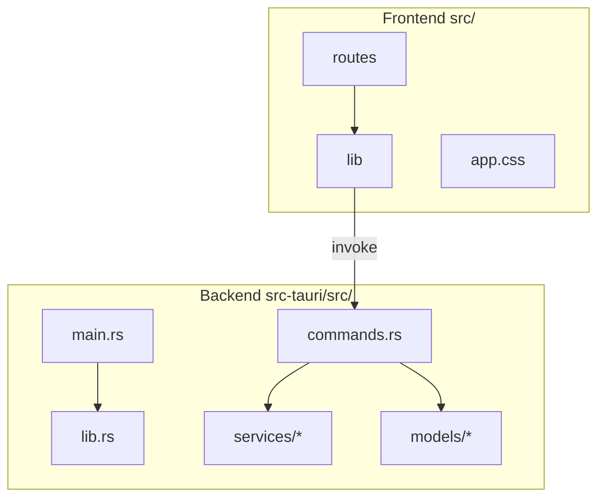

# Codigo-fonte — visao geral

Documentacao tecnica **por pastas**, alinhada a `src/` (SvelteKit) e `src-tauri/src/` (Rust/Tauri).

## Mapa modular (escalonavel)

## Onde ler o quê

| Area | Pasta de docs |
| -------------------------------- | -------------------------------------- |
| Fluxos ponta-a-ponta e diagramas | [fluxos-e-diagramas.md](./fluxos-e-diagramas.md) |
| Tabela comando invoke ↔ Rust ↔ TS | [ponte-tauri-invoke.md](./ponte-tauri-invoke.md) |
| Lista ficheiro a ficheiro | [indice-por-arquivo.md](./indice-por-arquivo.md) |
| SvelteKit, rotas, `lib/` | [frontend/README.md](./frontend/README.md) |
| Rust, comandos, servicos | [backend/README.md](./backend/README.md) |

## Principio de extensibilidade

- **Nova feature UI**: novo componente sob `src/lib/features/…` ou rota sob `src/routes/`; documentar no `README.md` correspondente dentro de `docs/codigo-fonte/frontend/`.
- **Nova capacidade do SO ou rede**: comando em `commands.rs`, logica em `services/`; atualizar `ponte-tauri-invoke.md` e `backend/servicos/…`.

## Ligacao ao restante da pasta `docs`

- Visao macro de produto: [../architecture/README.md](../architecture/README.md).
- Detalhe Steam (conceitos): [../architecture/steam.md](../architecture/steam.md).
- Modelo `Game` (dominio): [../models/game.md](../models/game.md).

## Comentarios no codigo

Ficheiros de `src/` e `src-tauri/src/` incluem um **comentario de modulo** (`/** … */` ou `//!`) a apontar para este indice onde fizer sentido, para navegacao IDE ↔ documentacao.
