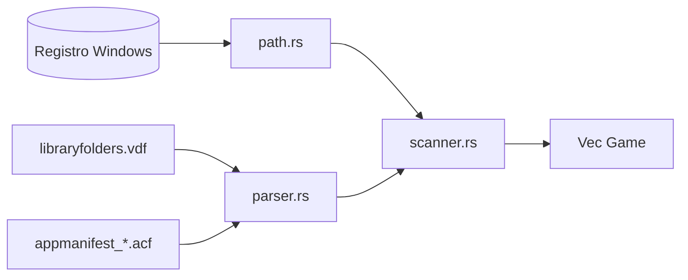

# Servico Steam (`services/steam/`)

Este modulo fecha o ciclo completo **offline** de descobrir jogos Steam instalados.



---

## `mod.rs`

Reexporta API pública:

```rust
pub use path::get_steam_path;
pub use scanner::scan_steam_games;
```

`get_steam_path` tambem é exposto como comando Tauri independente (diagnostico).

---

## `path.rs`

### `get_steam_path() -> Option<PathBuf>`

1. Abre `HKLM\SOFTWARE\Valve\Steam\InstallPath`.
2. Fallback `WOW6432Node` (instalacoes 32-bit registry shadow).

### `get_library_folders() -> Vec<PathBuf>`

1. Parte do `steam_root` da funcao acima (sempre incluido).
2. Le `steam_root/steamapps/libraryfolders.vdf`.
3. Usa `parse_libraryfolders` para extrair caminhos adicionais.
4. Deduplica com `HashSet`, ordena — estabilidade visual.

---

## `parser.rs`

Parser **propositalmente simples** (linha a linha, tokens entre aspas duplas) para:

| Funcao | Input | Output |
| ------ | ----- | ------ |
| `parse_libraryfolders` | conteudo `.vdf` | `Vec<PathBuf>` candidatos |
| `parse_appmanifest` | conteudo `.acf` | `AppManifest` struct interna |

Heuristicas:

- Claves `path` ou numericas com valor que “parece path” (`:\\`, `:/`, UNC `\\`).
- Normalizacao `\\\\` → `\` em caminhos VDF.

**Limitacoes conscientes**: nao implementa parser VDF completo com blocos aninhados recursivos — suficiente para linhas `key "value"` que a Steam emite.

---

## `scanner.rs`

`scan_steam_games()`:

1. Para cada raiz de biblioteca → `steamapps/`.
2. Filtra ficheiros `appmanifest_<appid>.acf`.
3. Parse → `AppManifest { app_id, name, install_dir, size_bytes }`.
4. Compoe `install_dir` absoluto: `steamapps/common/{installdir}`.
5. Empurra `Game` com defaults (`save_path: None`, `status: Pending`, etc.).
6. `HashSet` por `app_id` evita duplicados se manifestos repetidos.

### Exemplo mental de transformacao

```
library X/steamapps/appmanifest_620.acf
→ install_dir "Portal2"
→ full path .../steamapps/common/Portal2
```

---

## Relacao com documento largo

Detalhe conceptual adicional: [../../../architecture/steam.md](../../../architecture/steam.md).
