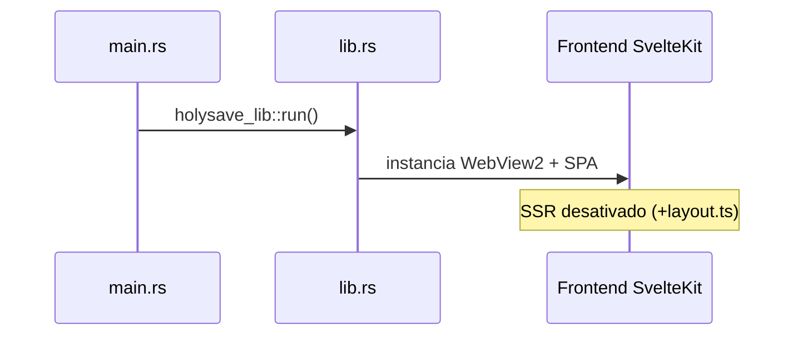
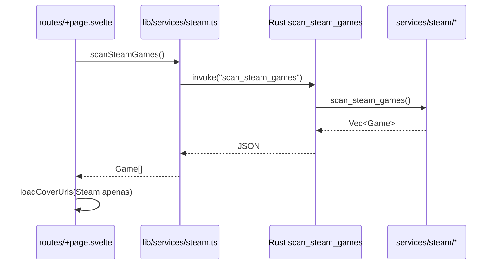
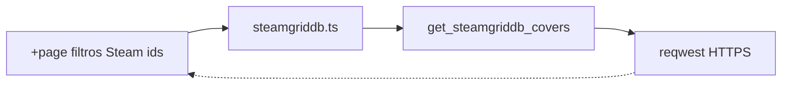
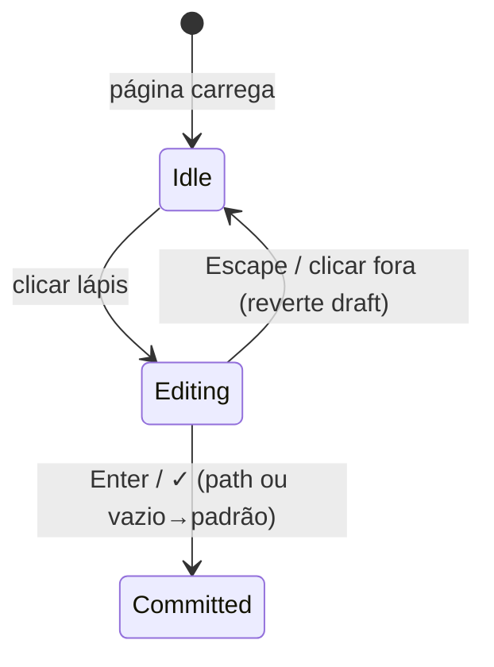
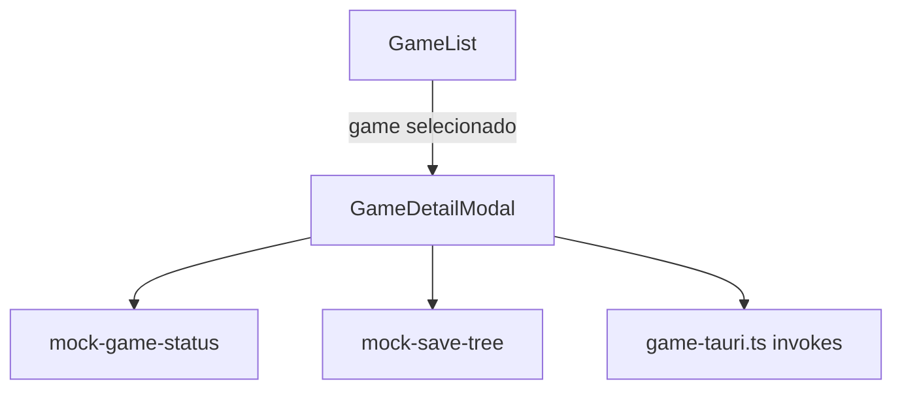
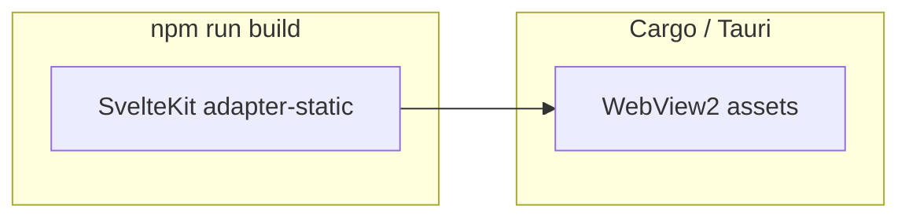

# Fluxos e diagramas

Diagramas conceiticos (Mermaid). Util para onboarding e revisoes de fluxo sem abrir todas as ferramentas.

---

## Arranque da aplicacao (desktop)

- `main.rs` apenas delega para a biblioteca (sem logica extra).
- `lib.rs` regista comandos IPC e plugins Tauri (`tauri_plugin_opener`).

---

## Carregar biblioteca na pagina inicial

1. Ao montar, `loadGames()` chama Rust.
2. Rust le registo Steam, `libraryfolders.vdf` e cada `appmanifest_*.acf`.
3. A UI opcionalmente pede imagens SteamGridDB (outro invoke).

---

## Capas SteamGridDB

- Requer variavel de ambiente `STEAMGRIDDB_API_KEY` no **processo** do binario Rust.
- Se a chave faltar ou a rede falhar, a UI deve degradar (`coverUrls = {}`), como em `loadCoverUrls`.

---

## Destino de backup (localStorage + padrão do SO)

- **Confirmado** (`backupPathCommitted`) persiste em `localStorage` (`holysave.backupDestination`).
- **Rascunho** pode divergir; backup global e botoes relacionados ficam inconsistentes até confirmar (`backupPathDirty`).

Implementacao paso-a-paso: ver [frontend/rotas.md](./frontend/rotas.md).

---

## Modal de detalhe do jogo

- Parte do conteudo e **ilusorio** (`mock-*`) para UX enquanto o pipeline real de saves nao liga aos dados Rust.
- Acoes reais (`open_folder`, `delete_save`) passam por `game-tauri.ts`.

Detalhes: [frontend/lib/features/game-library.md](./frontend/lib/features/game-library.md).

---

## SPA + Tauri (SvelteKit)

- Configuracao: `routes/+layout.ts` exporta `ssr = false` (sem Node no servidor; so WebView).
