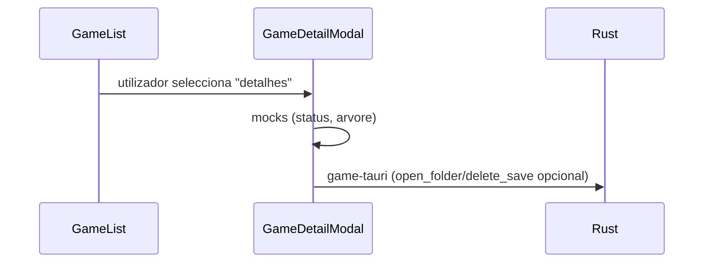

# Feature: biblioteca de jogos (`src/lib/features/game-library/`)

Pacote autocontido para lista, modal de detalhe, arvore ilustrativa e wrappers Tauri relacionados ao jogo.

---

## Fluxo de UI



---

## `GameList.svelte`

**Entradas** (entre outras propriedades/state passados pela pagina pai): coleccao `Game[]`, `coverUrls`, flag de erro, modo `grid`/`list`.

**Funcionalidades**:

- Render condicional modo grelha vs lista compacta (capas se URL existir para `coverUrls[id]`).
- Accoes rapidas (`openFolderPath`, backup mock, menus) usando `invoke` onde aplicavel através de `game-tauri.ts`.
- Abre **`GameDetailModal`** com o jogo selecionado.

**Notas de manutencao**: os handlers usam `@deprecated` sintaxe legacy `on:click|stopPropagation`; migracao planeada para `onclick` + `preventDefault()` equivalente segundo avisos do Svelte 5 checker.

---

## `GameDetailModal.svelte`

**Papel**:

- Sobreposicao fullscreen / dialog com detalhes ricos sobre um único `Game`.
- Estados locais `$state`/`$derived`/`$effect` para scroll, dados ilustrativos e acoes seguras ao fechar overlay (fechar clic no backdrop, ESC, foco inicial).

**Dados**:

- Labels de “saude”, datas e toggles vindos de [`mock-game-status.ts`](../../../../../src/lib/features/game-library/mock-game-status.ts).
- Árvore de pastas vindos de [`mock-save-tree.ts`](../../../../../src/lib/features/game-library/mock-save-tree.ts) + componente **[`FolderTree.svelte`](#foldertreesvelte)**.

**Accoes reais**:

- Abrir instalacao ou save usando `openFolderPath` com `game.install_dir` / `game.save_path`.
- Eliminar pasta de save através de `deleteGameSave(game)` (**destructivo**) com feedback esperado pela UI pai.

Esta separacao permite evoluir de mocks → dados vindos da API/backend sem reinventar markup.

---

## `FolderTree.svelte`

Implementacao **auto-recursive** em Svelte 5 (`FolderSubtree` mesmo ficheiro) para pintar tipo `MockTreeNode`:

```typescript
export type MockTreeNode = {
  name: string;
  children?: MockTreeNode[];
};
```

**Indentacao**: `padding-left` cresce com `depth`. Icon `◢` para pastas intermediarias.

Esta estrutura nao existe no disco — é preview narrativa até existir indexer real de saves.

---

## `game-tauri.ts`

Conveniente camada sobre `invoke` focada nas acções “por jogo”:

```typescript
export async function openFolderPath(path?: string | null): Promise<boolean> {
  /* valida trim, invoke open_folder ou false */
}

export async function deleteGameSave(game: Game): Promise<boolean> {
  try {
    await invoke("delete_save", { game });
    return true;
  } catch {
    return false;
  }
}
```

- **Beneficio**: `GameList`/Modal ficam só com UX (toasts/disabled buttons) independentes da serializacao exata Rust.

---

## `mock-game-status.ts`

Geradores **deterministicos** usando hash simple string→int:

- Rotaciona etiquetas tipo “Pronto para backup”, “Último jogo há dias…”.
- Gera timestamps “último backup” relativos aos dias há `h % 28`.

**Critico**: sempre documentar estas strings como ficticias quando apresentares dashboards em demos.

---

## `mock-save-tree.ts`

`buildMockSaveTree(game)` cria estruturas coerentes com `game.name`:

- Pasta raiz sanitizada `_Data`.
- Ramos `saves/profile`, `config`, etc.

Útil tanto para QA visual como placeholders enquanto o pipeline real lista ficheiros reais da maquina.
